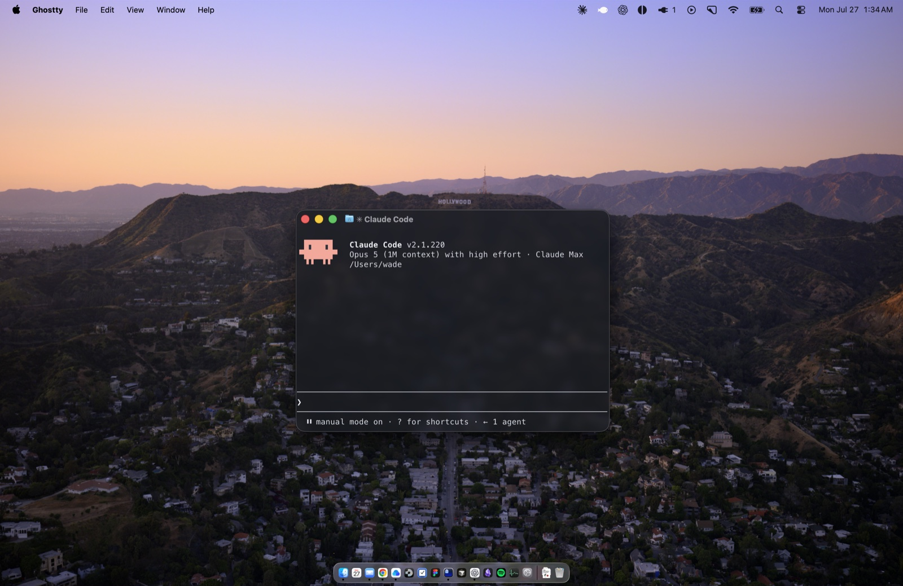

# WadeGhostty



Translucent dark theme for [Ghostty](https://ghostty.org) on macOS. One file, hand-maintained.

## Install

```sh
mkdir -p ~/.config/ghostty/themes
cp wadeghostty ~/.config/ghostty/themes/
```

Set `theme = wadeghostty` in `~/.config/ghostty/config`.

Don't also set `background-opacity` or `background-blur-radius` there — values in `config`
override the theme file, so setting them undoes the glass.

Once copied, this repository is no longer needed. Ghostty reads the copy in
`~/.config/ghostty/themes/`.

## Palette

| Slot | Normal | Bright |
| --- | --- | --- |
| Black | `#2E333C` | `#707888` |
| Red | `#FF7666` | `#FFA497` |
| Green | `#74DD6A` | `#A3F09B` |
| Yellow | `#ECD64C` | `#FAEA8B` |
| Blue | `#88B2FF` | `#AFCCFF` |
| Magenta | `#EE88EB` | `#F9B3F6` |
| Cyan | `#48E1E1` | `#8DF2F1` |
| White | `#D6DAE2` | `#F7F8FB` |

Background `#191C22` @ 72%, blurred 20px · Foreground `#ECEEF3` · Cursor `#D97757` ·
Selection `#3D4656`

Slots sit at the sRGB primaries and secondaries — OKLCH red 29°, yellow 100°, green 142°,
cyan 195°, blue 262°, magenta 328° — all clearing 6.5:1 on the plate.

Dark only, deliberately: blur turns the desktop behind the window to gray mush, which a dark
plate hides and a light plate reveals.

Ghostty has no separate bold color and no selection alpha, so selection carries a
pre-composited `#3D4656` rather than a translucent fill.

## TODO

- Refresh `preview.jpg` — the palette in the current capture is accurate, but it was framed
  for the old two-target repo and predates the rename. Recapture in Ghostty using the shipped
  theme and Berkeley Mono. The theme sets no `font-family`; the font comes from your own
  `config`.

## License

MIT — see [LICENSE](LICENSE).
