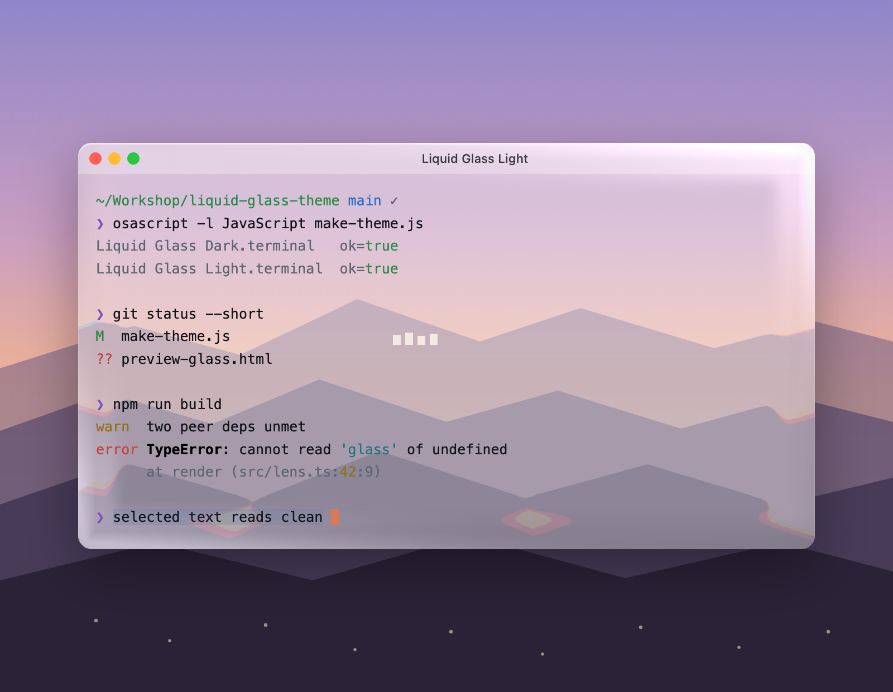

# Liquid Glass

A translucent theme for macOS Terminal.app — dark and light. Generated from one small
JXA script, so the palette lives in readable source instead of a binary plist.




## Install

```sh
open "Liquid Glass Dark.terminal"
open "Liquid Glass Light.terminal"
```

Each opens a new window using the profile and adds it to **Terminal → Settings → Profiles**.
Select one and click **Default** to keep it.

The translucency is real: the background color carries alpha and `BackgroundBlur` sets
the frost, so what's behind the window shows through.

## Palette

| Role | Dark | Light |
| --- | --- | --- |
| Background | `#191C22` @ 72% | `#FFFFFF` @ 38% |
| Blur | 0.62 — frosted | **0.00 — clear** |
| Text | `#ECEEF3` | `#101318` |
| Bold | `#FFFFFF` | `#000000` |
| Cursor | `#D97757` | `#D97757` |
| Selection | `#8A9BB8` @ 35% | `#6B82A6` @ 32% |
| Dim / comments | `#707888` | `#5F6672` |

Both share the same hues; only lightness moves. The cursor is the one constant across
the pair.

**The two profiles are not symmetrical, on purpose.** Blur averages the desktop behind
the window into flat gray mush. A dark plate hides that mush and reads rich, so dark is
frosted. A light plate reveals it and turns milky, so light carries no blur at all — it
is a clear pane with a thin white wash, and near-black text to hold contrast over
whatever it sits on. Light glass wants a clear pane; frost is a dark-mode luxury.

One other break from convention in the light theme: the **bright** ANSI slots go
*darker* rather than lighter. Brighter-than-white is invisible, so "bright" is read as
"more emphatic." `bright black` stays a light gray, since tools use it for comments.

## Regenerate

```sh
osascript -l JavaScript make-theme.js
```

Edit the `themes` object in `make-theme.js` — hex strings, or `['#RRGGBB', alpha]` for
the translucent slots — and re-run. Both `.terminal` files are rewritten in place.

Terminal caches an imported profile, so a regenerated file will not update a profile you
already imported. Delete the old one in **Settings → Profiles** first, then re-open the
file. Do not try to change the glass through Terminal's AppleScript `background color` —
that API silently drops the alpha channel and leaves the profile opaque.

## Previews

The screenshots above are not `backdrop-filter` fakes — the window plates are refracted
through a real `feDisplacementMap` lens, with chroma fringe at the rim, a baked specular
highlight, and blur matched to each profile's actual `BackgroundBlur`. Technique:
[Aave — Building glass for the web](https://aave.com/design/building-glass-for-the-web).

The page that renders them is kept out of this repo; its lens engine is derived from
Aave's shipped source and isn't mine to redistribute.

## License

MIT — see [LICENSE](LICENSE). Covers the theme and the generator, not the glass
technique referenced above.
