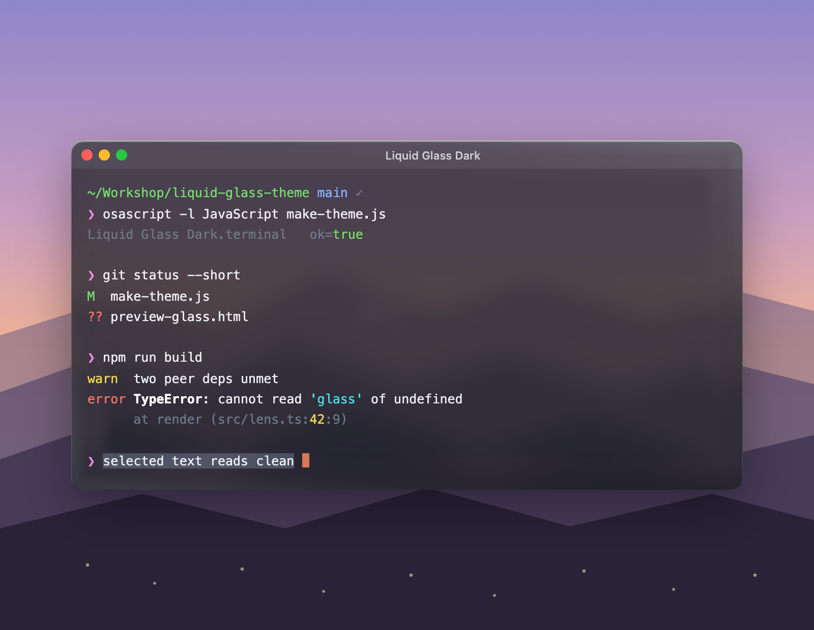

# Liquid Glass

A translucent dark terminal theme for macOS — for **Terminal.app** and **Ghostty**. The
Terminal profile is generated from one small JXA script, so the palette lives in readable
source instead of a binary plist.



## Install — Terminal.app

```sh
open "Liquid Glass Dark.terminal"
```

It opens a new window using the profile and adds it to **Terminal → Settings → Profiles**.
Select it and click **Default** to keep it.

The translucency is real: the background color carries alpha and `BackgroundBlur` sets
the frost, so what's behind the window shows through.

## Install — Ghostty

```sh
cp ghostty/liquid-glass-dark ~/.config/ghostty/themes/
```

Then in `~/.config/ghostty/config`:

```
theme = liquid-glass-dark
```

Reload with **⌘⇧,**.

The theme file carries its own `background-opacity` and `background-blur-radius`. **Do not
also set those two keys in `config`** — a value there wins over the theme file.

## Palette

| Role | Value |
| --- | --- |
| Background | `#191C22` @ 72% |
| Blur | 0.62 — frosted |
| Text | `#ECEEF3` |
| Bold | `#FFFFFF` |
| Cursor | `#D97757` |
| Selection | `#8A9BB8` @ 35% |
| Dim / comments | `#707888` |

| Slot | Normal | Bright |
| --- | --- | --- |
| Red | `#FF7666` | `#FFA497` |
| Green | `#74DD6A` | `#A3F09B` |
| Yellow | `#ECD64C` | `#FAEA8B` |
| Blue | `#88B2FF` | `#AFCCFF` |
| Magenta | `#EE88EB` | `#F9B3F6` |
| Cyan | `#48E1E1` | `#8DF2F1` |

The color slots sit at the sRGB primary and secondary hues — red 29°, yellow 100°,
green 142°, cyan 195°, blue 262°, magenta 328° in OKLCH — so each one is named on sight
rather than read as a pastel. Chroma is carried as far as the plate takes before the
color turns neon; lightness is set per hue so no slot jumps forward of the others.
Everything clears 6.5:1 against the background. Blue and cyan sit at the sRGB gamut
edge and cannot go further without losing lightness.

Frost is the reason this is a dark theme only. Blur averages the desktop behind the
window into flat gray mush; a dark plate hides that mush and reads rich, where a light
plate reveals it and turns milky.

## Regenerate

```sh
osascript -l JavaScript make-theme.js
```

Edit the `themes` object in `make-theme.js` — hex strings, or `['#RRGGBB', alpha]` for
the translucent slots — and re-run. `Liquid Glass Dark.terminal` is rewritten in place.
The Ghostty file in `ghostty/` is hand-maintained; keep it in step by hand.

Terminal caches an imported profile, so a regenerated file will not update a profile you
already imported. Delete the old one in **Settings → Profiles** first, then re-open the
file. Do not try to change the glass through Terminal's AppleScript `background color` —
that API silently drops the alpha channel and leaves the profile opaque.

## Previews

The screenshot above is not a `backdrop-filter` fake — the window plate is refracted
through a real `feDisplacementMap` lens, with chroma fringe at the rim, a baked specular
highlight, and blur matched to the profile's actual `BackgroundBlur`. Technique:
[Aave — Building glass for the web](https://aave.com/design/building-glass-for-the-web).

The page that renders it is kept out of this repo; its lens engine is derived from
Aave's shipped source and isn't mine to redistribute.

## License

MIT — see [LICENSE](LICENSE). Covers the theme and the generator, not the glass
technique referenced above.
